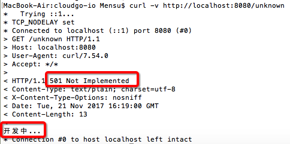

# cloudgo-io

> 课程《服务计算》作业五：用 Go 开发 web 应用程序 [cloudgo-io](http://blog.csdn.net/pmlpml/article/details/78539261)

## Install

```
go get github.com/Mensu/cloudgo-io
```

## 任务要求

### 基本要求

- [x] 支持静态文件服务
- [x] 支持简单 js 访问
- [x] 提交表单，并输出一个表格
- [x] 对 ``/unknown`` 给出开发中的提示，返回码 ``5xx``

### 提高要求

- [x] 分析阅读 gzip 过滤器的源码（就一个文件 126 行）
- [x] 编写中间件，使得用户可以使用 ``gb2312`` 或 ``gbk`` 字符编码的浏览器提交表单、显示网页。（服务器模板统一用 utf-8）

## 完成任务的证据

工作路径要求是源代码路径

```
$GOPATH/src/github.com/Mensu/cloudgo-io
```

### 支持静态文件服务

支持通过 ``/static/...`` 访问静态文件服务。``curl`` 给出证据：

```
curl -v http://localhost:8080/static/css/main.css
```


也可以通过浏览器更加直观地验证。背景的浅绿色样式和登录按钮的手势说明成功访问静态 css 文件：


### 支持简单 js 访问

```
curl -v http://localhost:8080/js
```

支持通过 ``/js`` 进行简单 js 访问。``curl`` 给出证据：


### 提交表单，并输出一个表格

支持在首页 ``/`` 提交登录表单，输出一个包含请求头部和表单内容的表格。``curl`` 给出证据：

```
curl -v -H "Content-Type: application/x-www-form-urlencoded" -d "username=服务计算&password=utf-8&token=1a4cd2df-ab48-46ff-8653-58d567e3a459" http://localhost:8080/table
```

```
$ curl -v -H "Content-Type: application/x-www-form-urlencoded" -d "username=服务计算&password=utf-8&token=1a4cd2df-ab48-46ff-8653-58d567e3a459" http://localhost:8080/table
*   Trying ::1...
* TCP_NODELAY set
* Connected to localhost (::1) port 8080 (#0)
> POST /table HTTP/1.1
> Host: localhost:8080
> User-Agent: curl/7.54.0
> Accept: */*
> Content-Type: application/x-www-form-urlencoded
> Content-Length: 79
>
* upload completely sent off: 79 out of 79 bytes
< HTTP/1.1 200 OK
< Content-Type: text/html; charset=utf-8
< Date: Tue, 21 Nov 2017 16:56:12 GMT
< Content-Length: 1188
<
<!DOCTYPE html>
<html>
<head>
  <meta name="viewport" content="width=device-width, initial-scale=1.0">
  <meta http-equiv="X-UA-Compatible" content="ie=edge">
  <link rel="stylesheet" href="/static/css/login.css"/>
</head>
<body>
  <table class="request-table">
    <caption>请求信息</caption>
    <thead>
      <tr>
        <th>键</th>
        <th>值</th>
      </tr>
    </thead>
    <tbody>

        <tr>
          <td>Accept</td>
          <td>*/*</td>
        </tr>

        <tr>
          <td>Content-Length</td>
          <td>79</td>
        </tr>

        <tr>
          <td>Content-Type</td>
          <td>application/x-www-form-urlencoded</td>
        </tr>

        <tr>
          <td>User-Agent</td>
          <td>curl/7.54.0</td>
        </tr>

      <tr>
        <td>用户名</td>
        <td>服务计算</td>
      </tr>
      <tr>
        <td>密码</td>
        <td>utf-8</td>
      </tr>
      <tr>
        <td>Token</td>
        <td>1a4cd2df-ab48-46ff-8653-58d567e3a459</td>
      </tr>
    </tbody>
  </table>
  <input type="button" class="back-btn" value="返回" />
  <script src="/static/js/login.js"></script>
</body>
</html>
* Connection #0 to host localhost left intact
```

也可以通过浏览器更加直观地验证：


### 对 ``/unknown`` 给出开发中的提示，返回码 ``5xx``

对于未知的路径，给出 ``开发中`` 的提示，返回码 ``501``。``curl`` 给出证据：

```
curl -v http://localhost:8080/unknown
```



### 编写中间件，使得用户可以使用 ``gb2312`` 或 ``gbk`` 字符编码的浏览器提交表单、显示网页。（服务器模板统一用 utf-8）

分析阅读 [negroni-gzip](https://github.com/phyber/negroni-gzip/blob/master/gzip/gzip.go) 后，参考其思路编写的中间件位于 [service/iconv.go](https://github.com/Mensu/cloudgo-io/blob/master/service/iconv.go)

#### 思路

利用接口的特性，编写代理结构，代理原来 ``req.Body`` 和 ``http.ResponseWriter`` 的 ``Read``、``Write``、``WriteHeader`` 方法。

将代理结构实例作为接口的实体给 ``next`` 函数。这样，下游调用接口的方法时，调用的就是我们写的代理方法，也就是说被我们编写的代理方法拦截。待我们稍作处理后（编码、解码、设置头部编码信息），才去调用原来的方法，从而达到该中间件的目的。

#### 测试命令

```
curl -v -H "Content-Type: application/x-www-form-urlencoded; charset=gb2312" -d @$GOPATH/src/github.com/Mensu/cloudgo-io/testdata/gb2312 http://localhost:8080/table | testEncoding
```

#### 测试数据

位于 ``testdata`` 文件夹，文件名标注了内容的编码。内容为 ``application/x-www-form-urlencoded`` 的表单，包含三个字段

- username：``服务计算``
- password：“编码是”+文件名，如 ``编码是utf-8``、``编码是gb2312``
- token：``ae2b0d3b-d4a5-4d15-b797-a557375cbec8``

例如，下面为文件 ``testdata/gb2312`` 的内容

```
username=服务计算&password=编码是gb2312&token=ae2b0d3b-d4a5-4d15-b797-a557375cbec8
```

#### 编码检测脚本 testEncoding

```js
const jschardet = require('jschardet');
let buffer = Buffer.from([]);
process.stdin.on('data', (data) => {
  buffer = Buffer.concat([buffer, data]);
});
process.stdin.on('end', () => {
  const { encoding } = jschardet.detect(buffer);
  console.log("/dev/stdin:", encoding);
});
```

```sh
# 编辑上述文件，命名为 testEncoding
vim testEncoding
# 安装 jschardet
npm i jschardet
# 将当前路径加入工作路径
PATH="$(PWD)":$PATH
# 使用
cat $GOPATH/src/github.com/Mensu/cloudgo-io/testdata/gb2312 | testEncoding
# 输出 "/dev/stdin: GB2312"
```

### 结果

``curl`` 给出证据：


